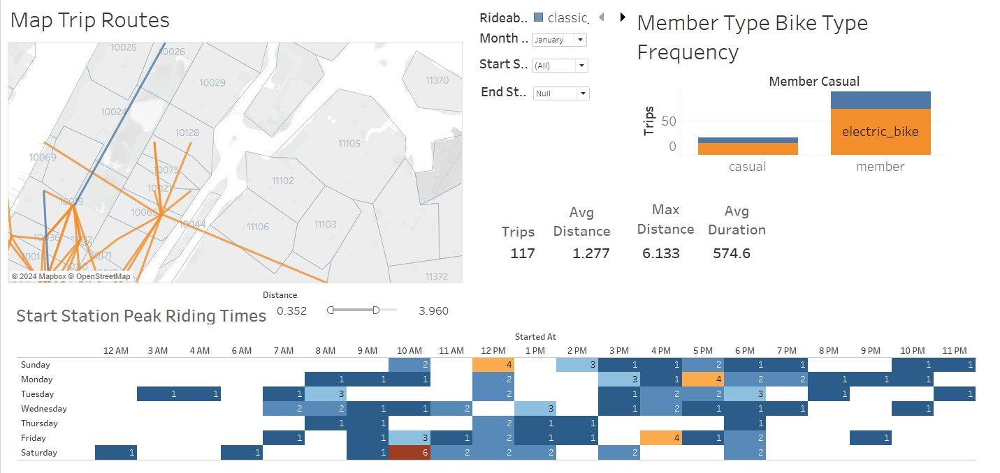

# Citi Bike Analysis using Tableau

## Problem

You have been hired as the lead analyst for the [New York Citi Bike](https://en.wikipedia.org/wiki/Citi_Bike) program. You are now resonsible for overseeing the largest bike-sharing program in the United States. In this new role, you will b expected to generate regular reports for city officials looking to publicize and improve the city program.

In this project, I created Tableau visualizations, dashboards and a story to analyze BikeCiti trip data.

## Solution

I decided to focus on the 2023 CitiBike trip data. I limited the data to the top 10 Starting Stations, in order to comply with the data size limitations on Tableau Public. I used Python Panda DataFrames to load the 40 trip data files. The data was cleaned of null vales, combined, and then exported to a single CSV file.

Datasets: Bike data is collected, organized, and made public on the [Citi Bike Data](https://www.citibikenyc.com/system-data) webpage.

## Findings

- Peak riding times on Monday - Friday are between 7 - 9 AM and 4 - 7 PM. Where the peak times on Saturday and Sunday were between 12 - 4 PM.

- Trips volume increased in the summer months. This includes both ride duration, ride distances, and number of trips.

- Classic bicycles are the most popular type of bike used. Both member types, casual and members used regurlar bicycles the most. This could be due to increased cost and lack of availability.

## Analysis

The main questions I answered for the analysis of CitiBike rider history, are;

1. Peak Riding times of the day of the week.

2. What are the average trip distances and durations throughout the year.

3. What are the perfered type of trips being taken and how they vary between members and casual riders.

## Visualizations

1. Top Start and End Stations

The top station is W 21 St. & 6 Ave. while the top ending station is 9 Ave. & W 22 St.

2. Peak Riding Start Times

To determine the peak riding times, I created a dynamic matrix of the number of rides by day and hour. Peak riding times Were between 7- 9 AM and 4 - &PM on weekdays. Where as, the weekend peak times were between 12 - 4 PM.

3. Trip distances and durations

The average daily and monthly trip distance were between 1.0 and 1.25 miles.
The average daily and monthly trip durations were between 13 and 18 minutes.

4. Trip Frequencies and Type

Trip frequencies increased in the summer and early fall months compared to the winter and late fall. The one surprise was that October 2024 had the second highest monthly frequency. This is probably due to sunny and above average temperatures that month.

As expected, Members used the service more frequently than casual users. However, both group frequencies increased and decreased in the same months.

## Dashboards

1. Main Dashboard

2. Trip Dashboard

Created a map of the of the trip route between start and end stations.

An interesting fining with this visualization was that there were trips starting and ending from the same station. 
i suspect these users were sight seeing and would return to their starting location.

## Presentation:  

[Tableau Dashboard](https://public.tableau.com/views/CitiBike2023_17315468207100/CitiBikeStory?:language=en-US&:sid=&:redirect=auth&:display_count=n&:origin=viz_share_link)

